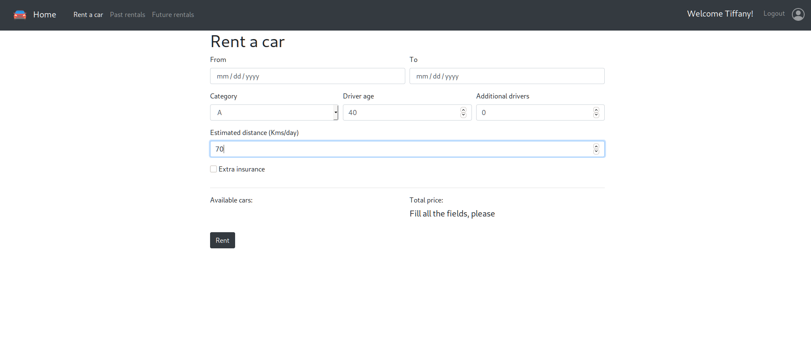

# Esame #1: "Noleggio veicoli"
## Studente: s270227 Gennero Stefano 

## React client application routes

- Route `/cars`: contiene la lista delle auto offerte dal servizio di noleggio. Se l'utente è autenticato la lista delle auto viene rimpiazzata da un configuratore interattivo per il noleggio
- Route `/login`: contiene il form del login
- Route `/past_rentals`: contiene i noleggi passati e quelli attualmente attivi dell'utente autenticato
- Route `/future_rentals`: contiene i noleggi futuri, non ancora attivi, dell'utente autenticato

## REST API server

- POST `/api/login`
  - request body: `username`, `password`
  - response body: `user`
- POST `/api/logout`
- GET `/api/cars`
  - response body: `cars`, la lista delle auto messe a disposizione
- GET `/api/cars/categories`
  - response body: `categories`, la lista delle categorie delle auto
- GET `/api/cars/brands`
  - response body: `brands`, la lista delle marche delle auto
- GET `/api/pastrentals`
  - request parameters: `user`
  - response body: `rentals`, i noleggi passati dell'utente
- GET `/api/futurerentals`
  - request parameters: `user`
  - response body: `rentals`, i noleggi futuri dell'utente
- POST `/api/rentals`
  - request parameters: `user`
  - request body: `rental`, il noleggio effettuato dall'utente
  - response body: `id`, id del nuovo noleggio
- DELETE `/api/rentals/:id`
  - request parameters: `id`, id del noleggio da eliminare
- GET `/api/user`
  - request parameters: `user`
  - response body: `user`, oggetto con i dati dell'utente
- POST `/api/payment`
  - request parameters: `user`
  - request body: `payment`, oggetto con i dati del pagamento
- GET `/api/carnumberandplate`
  - request parameters: `user`, `category`, `initialDate`, `finalDate`, parametri per calcolare il numero di auto disponibili
  - response body: `data`, oggetto contenente il numero di auto disponibili e la targa di una possibile auto da noleggiare
- GET `/api/price`
  - request parameters: `user`, `category`, `initialDate`, `finalDate`, `driverAge`, `additionalDrivers`, `kms`, `extraInsurance`, parametri per calcolare il prezzo dell'auto da noleggiare
  - response body: `price`, prezzo dell'auto da noleggiare

## Server database

- Table `USERS (id, mail, name, hash)`, contiene i dati relativi agli utenti
- Table `PRICES (id, element, price)`, contiene i parametri per il calcolo dei prezzi
- Table `CARS(plate, model, brand, category)`, contiene i veicoli dell'autonoleggio e le loro caratteristiche
- Table `RENTALS(id, initialDate, finalDate, category, driverAge, additionalDrivers, extraInsurance, kms, userId, plate)`, contiene i noleggi con le varie caratteristiche

## Main React Components

- `CarList` (in `CarList.js`): una tabella contenente l'elenco delle auto
- `Configurator` (in `Configurator.js`): genera i form di noleggio e pagamento
- `FilterList` (in `FilterList.js`): un contenitore per la lista dei filtri applicabili alle auto
- `FutureRentalList` (in `FutureRentalList.js`): un contenitore per la visualizzazione dei noleggi futuri e dei relativi dati, con possibile cancellazione
- `Header` (in `Header.js`): una barra di navigazione per tutte le pagine dell'App
- `LoginForm` (in `LoginForm.js`): un form per il login degli utenti
- `PastRentalList` (in `PastRentalList.js`): un contenitore per la visualizzazione dei noleggi passati e in corso e dei relativi dati

## Screenshot

## Test users

* tiffany@gmail.com, tiffany (frequent customer)
* george@yahoo.com, george
* albert@gmail.com, albert
* claire@some.com, claire
* sarah@mail.com, sarah
